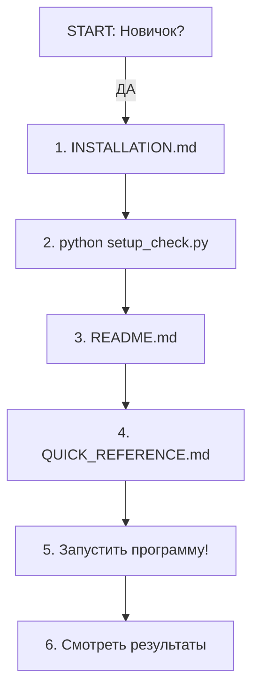
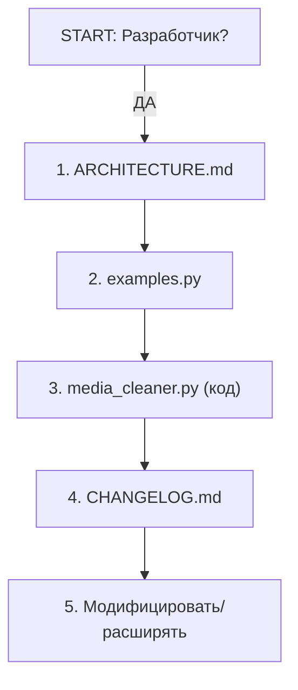
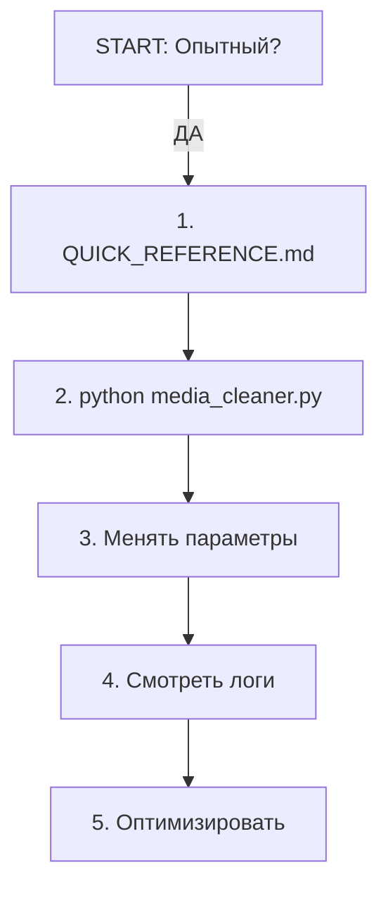

# 📑 INDEX — Полный указатель файлов и документации

## 🎯 С чего начать?

### Вы **первый раз** используете программу?
→ Прочитайте **[INSTALLATION.md](INSTALLATION.md)** (пошаговая установка)

### Вы **хотите быстро запустить**?
→ Прочитайте **[QUICK_REFERENCE.md](QUICK_REFERENCE.md)** (справочник)

### Вы **уже установили** и хотите понять как использовать?
→ Прочитайте **[README.md](README.md)** (полный гайд)

### Вы **разработчик** и хотите понять архитектуру?
→ Прочитайте **[ARCHITECTURE.md](ARCHITECTURE.md)** (технические детали)

### Вы **хотите увидеть примеры** кода?
→ Смотрите **[examples.py](examples.py)** (4 готовых примера)

### Вы **хотите узнать что изменилось**?
→ Прочитайте **[CHANGELOG.md](CHANGELOG.md)** (история версий)

---

## 📂 Структура проекта

### Основные файлы (не менять!)

| Файл | Описание | Размер |
|------|---------|--------|
| **media_cleaner.py** | Основная программа (рефакторена v2.0) | 24 KB |
| **config.json** | Конфигурация параметров | 1 KB |
| **requirements.txt** | Список зависимостей | <1 KB |
| **ffmpeg/** | Папка с FFmpeg утилитой | 40 MB |

### Документация

| Файл | Для кого? | Прочитать за |
|------|-----------|-------------|
| **README.md** | Пользователи | 15 мин |
| **QUICK_REFERENCE.md** | Опытные пользователи | 5 мин |
| **INSTALLATION.md** | Новые пользователи | 10 мин |
| **ARCHITECTURE.md** | Разработчики | 20 мин |
| **CHANGELOG.md** | Интересующиеся историей | 10 мин |
| **SUMMARY.md** | Краткое резюме | 5 мин |
| **INDEX.md** | Этот файл | 5 мин |

### Утилиты

| Файл | Описание | Как запустить |
|------|---------|--------------|
| **setup_check.py** | Проверка окружения | `python setup_check.py` |
| **examples.py** | Примеры использования | `python examples.py` |

### Логирование (создаётся автоматически)

| Файл | Описание |
|------|---------|
| **imperceptible_protected_video.log** | Логи при запуске программы |

---

## 🎓 Путь обучения

### Уровень 1️⃣: Новичок (первый день)

1. Установка
   - [ ] Прочитать **INSTALLATION.md** (10 мин)
   - [ ] Установить зависимости (5 мин)
   - [ ] Запустить `setup_check.py` (2 мин)

2. Первый запуск
   - [ ] Запустить **media_cleaner.py** (2 мин)
   - [ ] Обработать маленькое видео (5 мин)
   - [ ] Смотреть результат (2 мин)

3. Обучение
   - [ ] Прочитать **README.md** (15 мин)
   - [ ] Прочитать **QUICK_REFERENCE.md** (5 мин)

**Общее время**: ~50 мин ⏱️

### Уровень 2️⃣: Опытный (неделя)

1. Углубленное изучение
   - [ ] Прочитать **README.md** полностью
   - [ ] Пробовать разные параметры
   - [ ] Смотреть логи в `imperceptible_protected_video.log`

2. Примеры кода
   - [ ] Запустить **examples.py**
   - [ ] Модифицировать примеры
   - [ ] Интегрировать в свои проекты

3. Оптимизация
   - [ ] Найти оптимальные параметры
   - [ ] Бенчмарить производительность
   - [ ] Использовать GPU эффективно

### Уровень 3️⃣: Разработчик (месяц)

1. Архитектура
   - [ ] Прочитать **ARCHITECTURE.md**
   - [ ] Понять алгоритмы FGSM и психоакустику
   - [ ] Изучить код `media_cleaner.py`

2. Расширение
   - [ ] Добавить новые модели (ResNet50, ViT)
   - [ ] Улучшить аудио маскировку
   - [ ] Оптимизировать производительность

3. Интеграция
   - [ ] Встроить в CLI инструменты
   - [ ] Создать WebUI
   - [ ] Интегрировать в другие проекты

---

## 🔍 Быстрый поиск по темам

### Как... (Инструкции)

- Установить программу? → **INSTALLATION.md**
- Запустить программу? → **README.md** § Использование
- Обработать видео? → **QUICK_REFERENCE.md**
- Использовать из Python? → **examples.py**
- Менять параметры? → **QUICK_REFERENCE.md** § Параметры
- Смотреть логи? → **README.md** § Логирование
- Проверить окружение? → `python setup_check.py`
- Решить проблему? → **INSTALLATION.md** § Решение проблем

### Что... (Информация)

- Это такое? → **README.md** § Описание
- Изменилось в v2.0? → **CHANGELOG.md**
- Было исправлено? → **CHANGELOG.md** § Исправленные баги
- Требуется для запуска? → **INSTALLATION.md** § Требования
- Внутри происходит? → **ARCHITECTURE.md**
- Файлы в проекте? → **INDEX.md** (этот файл)

### Почему... (Объяснения)

- GPU используется? → **INSTALLATION.md** § Проверка CUDA
- Видео похоже на оригинал? → **ARCHITECTURE.md** § Как это работает
- Нейросети путаются? → **README.md** § Как это работает
- Нужны типы? → **ARCHITECTURE.md** § Качество кода

---

## 🚀 Типичные сценарии использования

### Сценарий 1: Обработать моё видео

```
1. Установка (первый раз)
   → INSTALLATION.md → pip install -r requirements.txt

2. Запуск
   → python media_cleaner.py

3. Выбор параметров
   → QUICK_REFERENCE.md § Параметры объяснены
```

### Сценарий 2: Интегрировать в свой код

```
1. Изучение API
   → examples.py (смотрите примеры)

2. Импорт в код
   from media_cleaner import VideoProcessor, AudioProcessor

3. Использование
   → ARCHITECTURE.md § Компоненты
```

### Сценарий 3: Расширить функциональность

```
1. Изучение архитектуры
   → ARCHITECTURE.md (полный разбор)

2. Изучение кода
   → media_cleaner.py (читайте с комментариями)

3. Модификация
   → Добавьте свои классы/функции
```

### Сценарий 4: Решить проблему

```
1. Первая помощь
   → python setup_check.py

2. Чтение логов
   → imperceptible_protected_video.log

3. Справочник проблем
   → INSTALLATION.md § Решение проблем

4. Дополнительная помощь
   → README.md § FAQ
```

---

## 📊 Статистика проекта

### Код

```
media_cleaner.py      24 KB   (775 строк кода)
config.json           1 KB    (все параметры)
examples.py          11 KB    (4 полных примера)
setup_check.py        3 KB    (проверка окружения)
```

### Документация

```
README.md             16 KB   (полный гайд)
ARCHITECTURE.md       17 KB   (разработчикам)
INSTALLATION.md       14 KB   (установка)
CHANGELOG.md          11 KB   (история)
QUICK_REFERENCE.md    8 KB    (справочник)
SUMMARY.md           14 KB    (резюме)
INDEX.md             этот файл
```

### Всего

```
Строк кода: ~800
Строк документации: ~2000
Строк примеров: ~200
Страниц документации: ~7
```

---

## 🎯 Рекомендуемый порядок чтения

### Для **новичков**



### Для **разработчиков**



### Для **опытных пользователей**



---

## ✅ Ваш чек-лист

- [ ] Прочитали INDEX.md (этот файл)
- [ ] Выбрали нужный документ для чтения
- [ ] Прочитали выбранный документ
- [ ] Установили программу
- [ ] Запустили первое видео
- [ ] Посмотрели результат
- [ ] Поэкспериментировали с параметрами

---

## 🔗 Быстрые ссылки

| Нужно | Ссылка |
|------|--------|
| Установка | [INSTALLATION.md](INSTALLATION.md) |
| Использование | [README.md](README.md) |
| Справочник | [QUICK_REFERENCE.md](QUICK_REFERENCE.md) |
| Архитектура | [ARCHITECTURE.md](ARCHITECTURE.md) |
| История | [CHANGELOG.md](CHANGELOG.md) |
| Примеры | [examples.py](examples.py) |
| Проверка | `python setup_check.py` |
| Запуск | `python media_cleaner.py` |

---

## 🎓 Дополнительные ресурсы

- [PyTorch документация](https://pytorch.org/docs)
- [OpenCV документация](https://docs.opencv.org)
- [Librosa документация](https://librosa.org)
- [FFmpeg документация](https://ffmpeg.org)

---

## 💡 Советы

1. **Начните с малого**: Обработайте 10-секундное видео для теста
2. **Смотрите логи**: `imperceptible_protected_video.log` содержит полезную информацию
3. **Используйте GPU**: Если у вас NVIDIA GPU, это будет в 10x быстрее
4. **Менять параметры**: Попробуйте разные epsilon и уровни звука
5. **Обращайтесь к примерам**: `examples.py` показывает все основные использования

---

## 🎉 Готово!

Теперь вы знаете где всё находится!

**Следующий шаг**: Выберите из списка выше ➡️

---

*Последнее обновление: 12 января 2026*

**Статус**: ✅ Всё готово к использованию!
